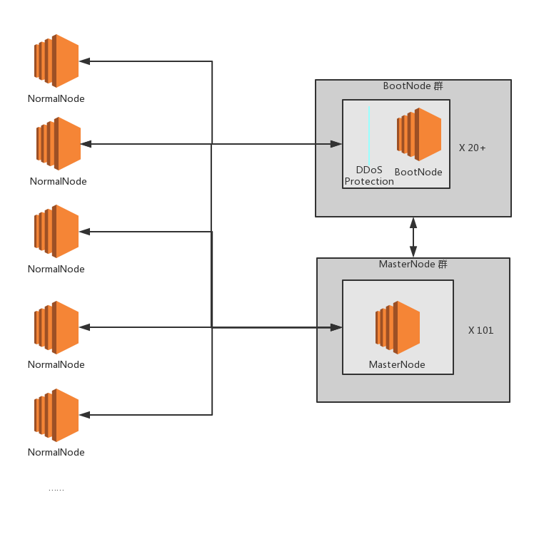

# VeChain core nodes security checklist

> by 慢雾安全团队 & Joinsec Team

## table of contents
* [security program](#Introduction-to-Security-Program)
* [core targets of framework](#core-targets-of-framework)
* [major problems VeChainThor is confronting](#major-problems-VeChainThor-is-confronting)
* [core design of framework architecture](#core-design-of-framework-architecture)
* [core defense](#core-defense)
* [recommended general framework](#recommended-general-framework)
    * [detailed explanation of each part of architecture design](#detailed-explanation-of-each-part-of-architecture-design)
        * [1. BootNode](#1-bootnode)
        * [2. MasterNode](#2-masternode)
* [security enhancement program](#security-enhancement-program)
    * [1. HTTP API security](#1-http-api-security)
        * [1.1 shielding HTTP API](#11-shielding-http-api)
        * [1.2 HTTP API defense](#12-http-api-defense)
    * [2. configuration security](#2-configuration-security)
        * [2.1 turn on logging](#21-turn-on-logging)
        * [2.2 set maximum number of connection peers](#22-set-maximum-number-of-connection-peers)
        * [2.3 avoid using 'root' to run 'thor'](#23-avoid-using-'root'-to-run-'thor')
        * [2.4 listen to random ports](#24-listen-to-random-ports)
    * [3. network security](#3-network-security)
        * [3.1 cloud service provider](#31-cloud-service-provider)
        * [3.2 DDoS defense](#32-ddos-defense)
    * [4. main server security](#4-main-server-security)
    * [5. threat intelligence](#5-threat-intelligence)
    * [6. NormalNode core security configuration summary](#6-normalnode-core-security-configuration-summary)
* [Acknowledgement](#Acknowledgement)

## Introduction to Security Program
Given the fact that VeChain decentralized design does not strictly rely on one single node, the core design dedicates to ensuring there are certain amount of secure masternodes in the entire network.

## core targets of framework

1. Protecting security of normal node's HTTP API.
2. Protecting the communication and operation of MasterNode server.
3. Protecting the communication and security of BootNodes in the preliminary stage.
4. Enhancing the main net anti-attack capability in the initial phase.

## major problems VeChainThor is confronting

1. Targeted attack on BootNode and MasterNode, such as DDOS attack.
2. HTTP API abuse and unauthorized access to HTTP API functions.
3. Network communication obstacles.

## core design of framework architecture

1. Guarantee the high availability of BootNode list and deploy targeted defense approach.
2. Compared to EOS framework, VeChainThor lowers the cost of single node adequately, and increases the number of nodes, and guarantees the stability of MasterNode.

## core defense

1. By default, HTTP API is closed. When it's necessary to open the HTTP，VeChainThor messes up the port and sets DDoS defense protection.
2. VeCHainThor increases the number of BootNodes, and is able to guarantee high recoverability after DDoS attack.
3. MasterNodes that are exposed to public network, are deployed with some anti-DDoS attack defense system, making sure the stability of entire network.

## recommended general framework

Architecture explanation：

Given the feature of VeChain, the core design of this architecture is to make sure the robustness of the entire network.

For against the DDoS attack, main nodes (BootNode and MasterNode) should deploy DDoS defense system, protecting BootNode providing inilization service for normal nodes;

and

because of the limited number of nodes in the initial phase, the entire network is deployed with over 20 BootNodes, and targeted defense approach is deployed for these BootNodes (such as deploying DDoS defense system) so as to anti DDoS concentration attack. BootNodes, of which quantity exceeds 20, are hard to be brought down.

### detailed explanation of each part of architecture design

#### 1. BootNode
BootNode is a fixed network initialization node, used for discovering other nodes. The core defense strategy is to increase the number of nodes and distribute nodes to different network segments. It is suggested to use DNS (instead of fixed IP) nodes, and over 20 hard coded domains should be reserved for BootNode. In addition, nodes only turn on P2P ports and deploy DDoS defense strategy.

#### 2. MasterNode

There are 101 MasterNodes in the VeChainThor network. VeChain official recommendation is to deploy MasterNodes in the internal network, and they are hard to be attacked because this part of master nodes are of a large quantity. But for MasterNodes whose protocols are exposed in the public network, it's necessary to deploy anti-DDoS defense strategy. 

## security enhancement program

### 1. HTTP API security

#### 1.1 shielding HTTP API

It is suggested not to publish the HTTP API (Starting/Initialization without any manual settings/interference guarantees the privacy of http api).

#### 1.2 HTTP API defense

It is not suggested to publish the node API to the public network, if it is needed to expose the HTTP API to the public, some protection procedures should be added prior to HTTP request. 

### 2. configuration security

#### 2.1 turn on logging

-It is suggested to set `--verbosity 9` initialization parameter for BootNode and MasterNode, so as to record the complete logs.

#### 2.2 set maximum number of connection peers

- Initialization parameter `--max-peers` is able to set maximum number of concurrent connections number of P2P ports. The default connections number is 25 and it can be configured according to node's capability. Meanwhile, VeChainThor node holder can optimize the `ulimit` system parameter and kernel parameter, strengthening the resistance of continuous attack.

#### 2.3 avoid using 'root' to run 'thor'

It is suggested to create a normal user account after compiling, and use this account to start running `bin/thor` instead of using root, for relieving risks.

#### 2.4 listen to random ports

- `--api-addr IP:PORT`
- `--p2p-port PORT`

Listen to one random port every time when starting the node, it is recommended to adopt configuration approaches from [main server security](#4-main-server-security).

### 3. network security

#### 3.1 cloud service provider

Throughout the tests of slow mist team, Google Cloud, AWS and UCloud have better performance on anti-DDoS attack. Moreover, service providers will not temporarily close the server after DDoS attack and it is rather fast to recover the network availability, thus it is recommended to use these cloud services for core nodes (Pay attention to choosing cloud service providers: many cloud service providers temporarily close the server after DDoS attack).

#### 3.2 DDoS defense

For coping with potential DDoS attack, it is suggested to deploy nodes in the internal network, if nodes are exposed to public network, DDoS protection should be deployed. It is suggested to deploy DDoS  defense protection service such as Cludflare, AWS Shield for core nodes.  

### 4. main server security

- Avoiding scanning the DDoS defensed server by entire network, change the synchronous port 11235 (and also HTTP API port: 8669) into most popular ports, such as 80, 443, and 22, so as to significantly raise the positioning cost of attackers.  
- Close the irrelevant service ports, and set strict security rules for AWS or Google Cloud.  
- Change SSH default ports: 22, restrict the SSH to use only key (and encrypt the key) to login. Forbid using password to login, and restrict that only our operation side's IP is able to access SSH.
- Under the situation of owning sufficient budget, it is suggested to deploy advanced HIDS (Host Instruction Detection System) (It is strongly recommended to take reference from the OSSEC open source project) to cope with server attack.

### 5. threat intelligence

- It is highly suggested to collect important logs, storage and analysis work. These logs include: the entire logs of HTTP API and P2P port communication, the main server system logs, node related programme operation logs. Storage and analysis work can choose self-created schema like ELK (ElasticSearch, Logstash, Kibana) open source programs, also we can choose some advanced commercial platforms.
- Once choosing the mature cloud service providers, their control panels have many threatening information related modules that can be taken reference so as to discovering exception in advance.
- Once nodes have got serious bugs and attacking information, start the contingency plan immediately that includes disaster preparedness strategies and upgrading strategy.
- Community information should be exchanged and shared.


### 6. NormalNode core security configuration summary
1. Choose reliable cloud service providers, such as Google Cloud, AWS and UCloud, to build node infrastructures. Server hardware should be configured with dual-core processor with 4G memory or more advanced.
2. Configuration rules forbid the access of server ports that is irrelevant to node service (SSH only enables credentials to access and only IPs from our operational side can connect to the SSH port).
3. When using root to start node programme, we start with `--p2p-port PORT`, enabling listening to the random P2P protocols, and if it's not necessary, VeChainThor just configures the HHTP API to merely listen to the local host.

## Acknowledgement

We would like to express great regards to

* VeChain Team

Providing great support for node security testing.

